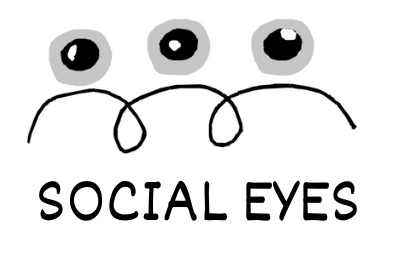
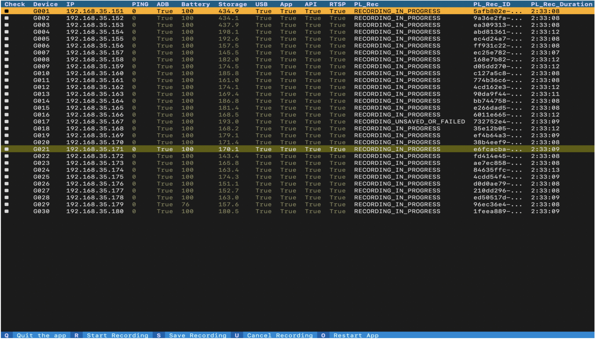

<div align="center">
  <a href="https://github.com/beatlab-mcmaster/SocialEyes">
    
  </a>
</div>

<div align="center">
  <!-- SocialEyes -->
  <br />
  <a href="https://tinyurl.com/socialeyes-beatlab"><strong>Check out an example video of the output »</strong></a>
  <br />
  <br />
  <a href="https://github.com/beatlab-mcmaster/SocialEyes/issues/new?assignees=&labels=bug&template=01_BUG_REPORT.md&title=bug%3A+">Report a Bug</a>
  ·
  <a href="https://github.com/beatlab-mcmaster/SocialEyes/issues/new?assignees=&labels=enhancement&template=02_FEATURE_REQUEST.md&title=feat%3A+">Request a Feature</a>
  .
  <a href="https://github.com/beatlab-mcmaster/SocialEyes/discussions">Ask a Question</a>
</div>

<div align="center">
<br />

[](./LICENSE)   [](https://programs.sigchi.org/chi/2025/program/content/188227) [](https://dl.acm.org/doi/10.1145/3706598.3713910)


<!-- [](https://github.com/beatlab-mcmaster/socialeyes/issues?q=is%3Aissue+is%3Aopen+label%3A%22help+wanted%22) -->
</div>


<details open="open">
<summary>Table of Contents</summary>

- [Overview](#overview)
- [Hardware prerequisites](#hardware-prerequisites)
- [Software prerequisites](#software-prerequisites)
- [Quick start](#quick-start)
- [Interfaces](#interfaces)
    - [Terminal User Interface (TUI)](#terminal-user-interface-tui)
    - [Centralcam interface](#centralcam-interface)
    - [Offline interface](#offline-interface)
- [Code Structure](#code-structure)
    - [SocialEyes modules](#socialeyes-modules)
    - [Configuration files](#configuration-files)
    - [SocialEyes paper analysis code](#socialeyes-paper-analysis-code)
- [Example screenshot](#example-screenshot)
- [Citation](#citation)
- [License Information](#license-information)

</details>

---

## Overview 

**SocialEyes** enables **eye-tracking in multi-person, real-world settings** using mobile eye-tracking glasses. 

For a detailed description, refer to the original paper:  
***Shreshth Saxena, Areez Visram, Neil Lobo, Zahid Mirza, Mehak Rafi Khan, Biranugan Pirabaharan, Alexander Nguyen, and Lauren K. Fink (2025). SocialEyes: Scaling mobile eye-tracking to multi-person social settings. In Proceedings of the 2025 CHI Conference on Human Factors in Computing Systems (CHI '25). Association for Computing Machinery. https://doi.org/10.1145/3706598.3713910***  


The paper presents a hardware-agnostic system architecture for multi-person mobile eye-tracking.

This repository contains a reference implementation of the SocialEyes architecture, used in the Utility Test presented in the paper. It serves as a proof-of-concept demonstrating the viability of our system architecture in real-world contexts.

<!-- <a href="https://discord.gg/W5M57u9hFz">
    </a> -->

## Hardware Prerequisites

This implementation relies on the following hardware for data collection:
- Eye-tracking glasses: [Pupil Labs' Neon](https://pupil-labs.com/products/neon). 
- Centralview Camera: Any standard USB or network webcam. Compatibility for [ArduCam's Camera Evaluation Kit](https://www.arducam.com/product/arducam-2-2mp-mira220-rgb-ir-global-shutter-usb3-0-camera-evaluation-kit/) is also provided but currently lacks Image Signal Processing (ISP) support from the manufacturer.

## Software Prerequisites 

You can execute the code either with a software container (using Docker, Podman, etc.) or by building it from source. Please note that the source has only been tested on Ubuntu OS. Below are some prerequisites you may need when running the software:

### 1. Using a Container (Recommended for Windows and macOS)
- Install [Docker](https://docs.docker.com/get-started/get-docker/) (or your preferred containerization tool).

### 2. Using Source
- Install the latest Python distribution: [Download Python](https://www.python.org/downloads/)

To ensure dependencies are properly managed, we recommend creating a separate Python environment using either **conda** or **virtualenv**.

> **With Conda (Recommended)**

- Install Anaconda or Miniconda from [here](https://docs.anaconda.com/getting-started/).
- Create a new environment:  
  `conda create -n SocialEyes python=3.10`
- Activate the environment:  
  `conda activate SocialEyes`

> **With Virtualenv**

- Install virtualenv:  
  `pip install virtualenv`
- Create a new environment:  
  `virtualenv SocialEyes`
- Activate the environment:
  - On **Linux/macOS**:  
    `source SocialEyes/bin/activate`
  - On **Windows**:  
    `.\SocialEyes\Scripts\activate`

## Quick start

### **Using Container (Recommended for Windows and macOS)**

1. Clone the repository:  
   `git clone --recurse-submodules https://github.com/beatlab-mcmaster/SocialEyes.git SocialEyes`

2. Navigate to the code directory:  
   `cd SocialEyes`

3. Build the Docker image:  
   `docker build -t socialeyes-img .`
   
4. Mount your drive and run the container in privileged mode to allow access to local machine resources (USB/camera/network):
    ```bash
    docker run --rm -it --privileged -v $(pwd):/SocialEyes socialeyes-img
    ```
    **Hint**: On Windows, use `${PWD}` in PowerShell instead of `$(pwd)`.


### **Using Source (Tested on Ubuntu 22.04.03 LTS, ADB v28, and Python 3.9+)**

1. Clone the repository:  
   `git clone --recurse-submodules https://github.com/beatlab-mcmaster/SocialEyes.git SocialEyes`

2. Navigate to the code directory:  
   `cd SocialEyes`

3. Install the required dependencies:  
   `pip install -r requirements.txt`

4. Run the demo script:  
   `python demo.py`


The quick start opens a demo script that links to the three main operator interfaces in SocialEyes recording mode, as defined below:

## Interfaces 

### Terminal User Interface (TUI)
The eye-tracking data collection in our implementation is facilitated with the help of a Textual TUI. The TUI displays a list of static IP addresses that could be assigned in the associated config file (src/glassesET/config.json). Note that the eye-tracking devices can also be detected using a DNS search, however, in our tests, we could not reliably retrieve all devices on network with the Pupil-labs-realtime-api. We, therefore, use static IPs to connect to each smart-phone device accompaning the NEON eye-trackers.

On the TUI, use arrow keys to move up-and-down through the list of devices.
Press Spacebar to select a device. Selected devices are indicated by a checkbox in first column.
In addition, TUI has following hotkeys enabled
- Shift + Arrow Up/Down: to expand selection up/down
- Ctrl+A to select all devices
- Exclamation mark (!) to reverse selection

The bottom bar presents a list of actions that can be performed on the selected devices.

<!--  -->


### CentralCam interface
The CentralCam interface operates the centralview Camera recording. By default, the CentralCam module records video and metrics from the default webcam on a computer. The recording device and related parameters can be set using the config file at `src/centralCam/config.json`

Recording starts upon execution of the module and can be manually stopped at any point using a Keyboard Interrupt (Ctrl/Cmd + C)


### Offline interface
The offline interface facilitates analysis on the recorded data. It allows downloading data from Pupil Cloud or using locally stored data to perform operations of `homography`, `analysis`, and `visualisation` modules. 

The Offline interface can be operated using arrow keys to navigate different options and using the command line interface to input text or filepaths.


## Code structure

### SocialEyes modules

- All module implementations are located in the ['src/'](src/) directory and can be executed independently using the respective `main.py` script.

- Upon execution, the [GlassesRecord](src/glassesRecord/) module and the [CentralCam](src/centralCam/) module will spin up the [TUI](#terminal-user-interface-tui) and the [CentralCam Interface](#centralcam-interface) interface respectively. Use the interface to perform subsequent actions for the respective module.

- The [Homography](src/homography/), [Visualisation](src/visualisation/), and [Analysis](src/analysis/) modules provide helper functions that can be exported to analysis environments or interfaced with the [Offline Interface](#offline-interface) in [src/offlineInterface](src/offlineInterface/)

### Configuration files 

- We have provided example config files for each module. 
- Before running a module, make sure to update it's parameters in the respective 'config.json' file in the module directory.

### SocialEyes paper analysis code

All code used to generate results and figures for the SocialEyes paper can be found in ['src/analysis/Utility test analysis code/'](src/analysis/Utility%20test%20analysis%20code/)


## Example snapshots

Example visualisations of 30 eye-tracking datasets recorded and analysed with this implementation is presented below for reference. The gaze from 30 wearers--recorded using the GlassesRecord modul--is mapped and projected to a common space, the centerview--recorded using the CentralCam module. Projected gaze from all wearers is presented as a heatmap in the central grid cell with each wearer's egocentric gaze and worldview recording in the surrounding cells. The gaze projection and display was performed with the Analysis, Homography, and Visualisation modules.


## Citation   

If you use any ideas from the paper or code from this repo, please cite the original work:

```
@inproceedings{SocialEyes,
  author    = {Shreshth Saxena and Areez Visram and Neil Lobo and Zahid Mirza and Mehak Rafi Khan and Biranugan Pirabaharan and Alexander Nguyen and Lauren K. Fink},
  title     = {SocialEyes: Scaling Mobile Eye-tracking to Multi-person Social Settings},
  year      = {2025},
  booktitle = {Proceedings of the 2025 Conference on Human Factors in Computing Systems (CHI 2025)},
  location  = {Yokohama, Japan},
  doi = {10.1145/3706598.3713910},
  publisher = {Association for Computing Machinery}
}
```

## License Information

This software is licensed under the **Non-Commercial Research License (NCRL-1.0)**.  
Commercial use is restricted. Please see the LICENSE file for details.

This repository includes the SuperGlue software as a submodule.
SuperGlue is licensed under the "Academic or Non-Profit Organization Noncommercial Research Use Only" license.
Please refer to the LICENSE file within the SuperGlue submodule for more details on its terms and restrictions.


---

[](https://github.com/ShreshthSaxena)
